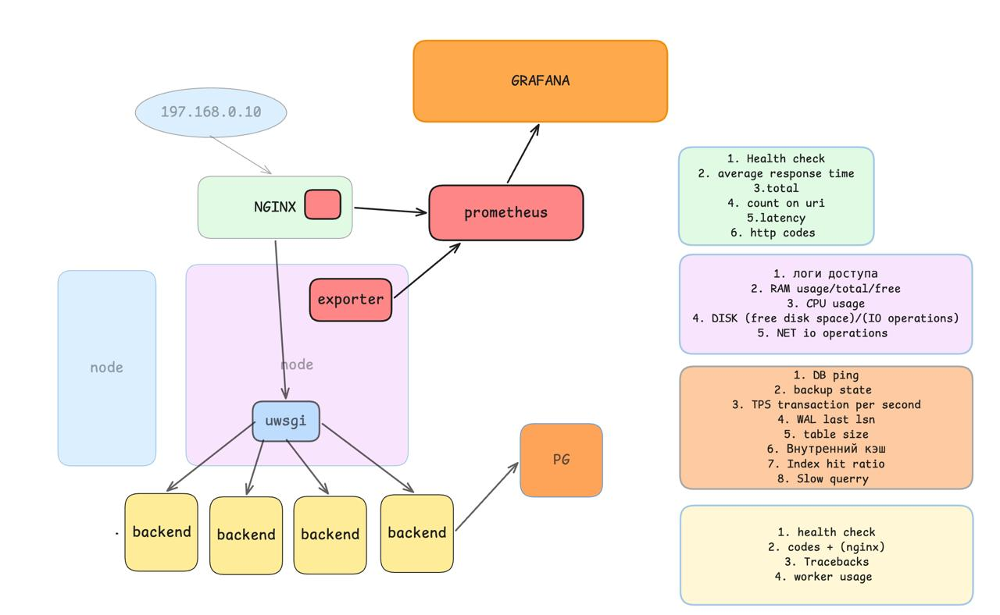

## Задание

Задание: у вас есть после 5 лабы приложение на flask которое работает с БД
Теперь вам необходимо соорудить у себя мониторинг этого сервиса

Что конкретно необходимо:
1. Поднять ваше приложение внутри docker 
2. Рядом написать compose внутри которого будет prometheus + grafana (данные должны сохранятся после up/down)
3. Почитать про prometheus-node-exporter 
https://prometheus.io/docs/guides/node-exporter/
https://hub.docker.com/r/prom/node-exporter

4. Подключить Node exporter к прометеусу и внутри prometheus сделать один-два запроса чтобы научитсья работать с ним (построить график потребляния RAM)
5. Подключить данные из prometheus в графану
6. Повторить П3-5 для nginx и postgresql (как научить nginx отдавать метрики - загуглите)
7. С помощью wrk "пострелять в свой сервис" и понять при каком RPS он начинает отказывать 

DOD (что есть выполненная работа):
Формат сдачи: физически очно показываете лабу

1. nginx вашего сервиса умеет отдавать полезные метрики (вы должны обьяснить какие метрики вы считаете полезными)
2. В prometheus есть данные по хосту, nginx, базке
3. Сделаны дашборды в grafana по каждому кусочку сервиса (бд, хост, вебка)
4. На графиках можно явно увидеть что происходит не так

***- если вы не разобрались с тем, как работает ваше приложение в 5 лабе то можно попробовать написать простой flask который умеет только отдавать hello world, можно будет без мониторинга базки

—-
Для тех кому мало
1. Настроить сборку логов с nginx с помощью file-beat (для этого вам понадобится поднять file-beat рядом с nginx и где-то в другом месте elasticsearch который будет принимать все логи
2. Настроить Алерты внутри grafana (к примеру если CPU/RAM usage больше 60% или сервис не отвечает)

